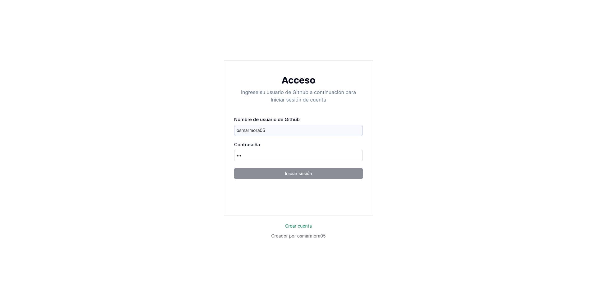
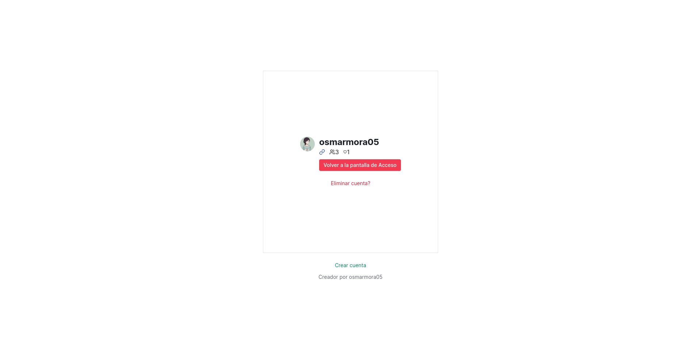
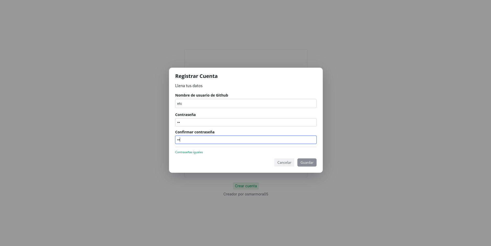

<div align="center"> 
    <h1>Minimalist login chadcn-ui</h1>
</div>

<div align="center"> 
   
   
   
   

</div>

<div align="center">
  <br/>
  <a href="./README.es.md">Spanish</a> | <a href="./README.md">English</a>
  <br/>
</div>

# Descripción del proyecto

"minimalist-login-chadcn-ui", es un login como su nombre lo indica minimalista inspirado en la libreria de componente [shadcn/ui](https://ui.shadcn.com/), que consta con conexion a [Turso](https://turso.tech/), implementación de técnicas de encriptación para proteger los datos de los usuarios y se utiliza [SQLModel](https://sqlmodel.tiangolo.com/) para la gestion con la BD. Este proyecto fue realizado para la clase Ingenieria de Apliciones web como practica del tema de vurenabilidades de paginas web, en el que se implementa tecnicas como SQLInjection y mas cosas que no me acuerdo :v

# Vista previa

| <center><b>Galeria</b></center>                                              |
| ---------------------------------------------------------------------------- |
|  |
|  |
|  |

## Prerrequisitos

- Python

# Guía de instalación

1. **Clonar el repositorio:**
   Utilice el siguiente comando para clonar el repositorio del proyecto y navegar al directorio del proyecto:

   ```sh
   git clone https://github.com/osmarmora05/minimalist-login-chadcn-ui.git && cd minimalist-login-chadcn-ui
   ```

2. **Configurar un entorno virtual:**
   Cree un entorno virtual para gestionar las dependencias del proyecto por separado:

   ```sh
   python -m venv venv
   ```

3. **Activar el entorno virtual:**
   Dependiendo de su sistema operativo, active el entorno virtual usando uno de estos comandos:

   - Windows:

   ```sh
   .\venv\Scripts\activate
   ```

   - Unix/Linux:
     ```sh
     source venv/bin/activate
     ```

4. **Instalá las dependencias requeridas**

   ```sh
    pip install -r requirements.txt
   ```

5. **Establece las variables de entorno**
   Deberas crear dentro del directorio raiz del proyecto el siguiente archivo: `.env` con el siguiente contenido:

   ```JavaScript
   TURSO_DATABASE_URL=*****
   TURSO_AUTH_TOKEN"*******"
   CRYPTOGRAPHY_KEY='******'
   ```

   Para obtener los valores de las variables de entorno ponte en contacto conmigo

6. **Pon en marcha el proyecto**
   ```sh
    reflex run
   ```
   _Quizas el comando para ejecutar el proyecto no funcione o sea distinto ya que en el momento que estoy creando este proyecto
   reflex aun sigue en desarrollo y esta sujeto a cambios_

# Tecnologias

<div style="display: flex; flex-direction: row; width: 100%; gap: 10px">


</div>

# Autores

- Osmar Adrian Mora Cerna [@osmarmora05](https://github.com/osmarmora05)
